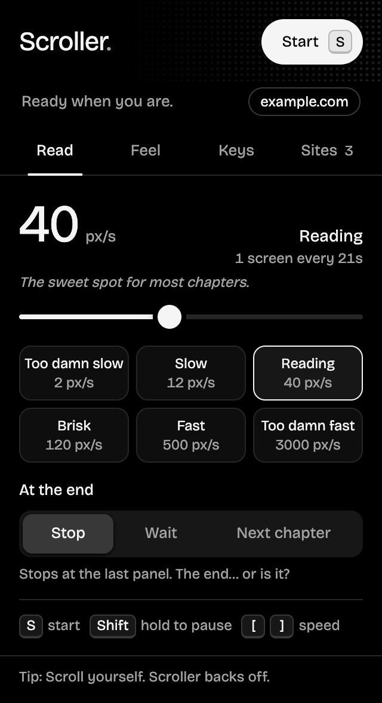
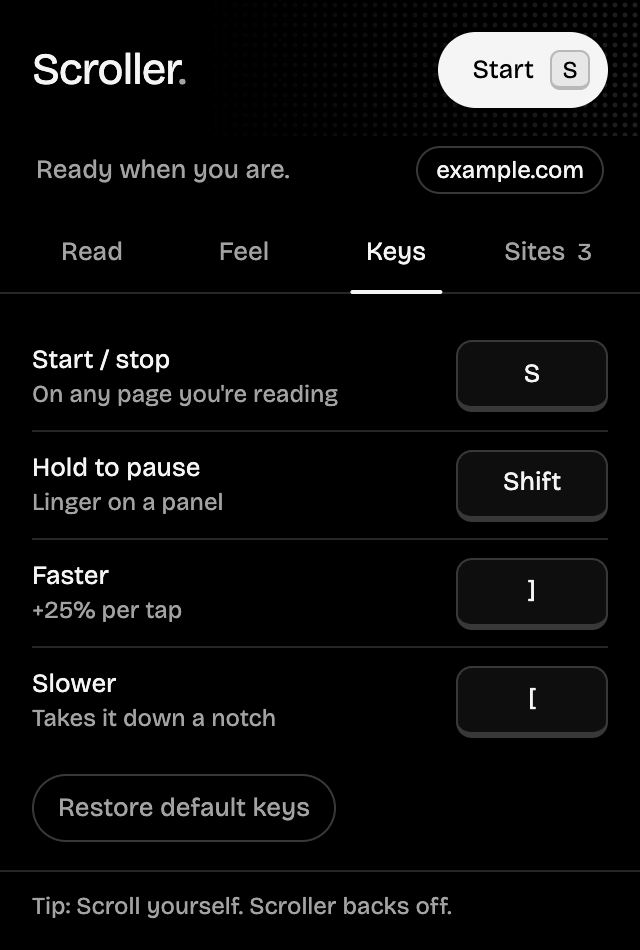
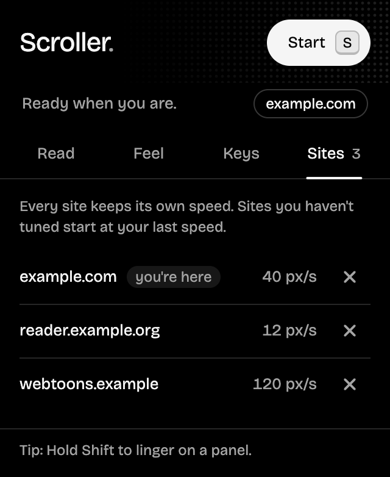

<p align="center">
  
</p>

<h1 align="center">Scroller</h1>

<p align="center">
  Hands-free auto-scroll for reading manga, webtoons and long pages.<br>
  Press one key, sit back, read top to bottom at exactly the speed you want.
</p>

<p align="center">
  
</p>

<table align="center">
  <tr>
    <td></td>
    <td></td>
    <td></td>
  </tr>
  <tr>
    <td align="center"><b>Feel</b></td>
    <td align="center"><b>Keys</b></td>
    <td align="center"><b>Sites</b></td>
  </tr>
</table>

## Features

- **A popup that stays out of the way.** Pure black for night reading, four tabs (Read, Feel, Keys, Sites) that each fit without scrolling, and red reserved for one thing: scrolling right now.

- **One key to start and stop.** Defaults to `S`; change it to any key you like.
- **Any speed, 1 to 5000 px/s.** A logarithmic slider gives the slow end as much room as the fast end. Type an exact number, or pick a preset from *Too damn slow* to *Too damn fast*.
- **Remembers speed per site.** Every reader sizes its pages differently, so each site keeps its own speed. New sites start from the last speed you used. The **Sites** tab lists every site's speed; forget any of them (with undo).
- **Hold to pause.** Hold `Shift` to freeze on a dense panel; let go and it carries on.
- **Next chapter, automatically.** At the end of a chapter Scroller can find the reader's *Next* button and keep going on the next one. A whole series, hands-free.
- **Adjust while reading.** `]` speeds up 25%, `[` takes it back down a step.
- **Glide or page jumps.** Scroll continuously, or jump ½, ¾ or a full screen at a time.
- **Up or down.**
- **Gentle starts and stops.** Eases in and out instead of lurching.
- **Pauses when you scroll yourself**, then eases back in after two seconds.
- **Status at a glance.** A red **ON** badge on the toolbar icon, plus an optional pill on the page showing the speed.
- **Works on tricky readers.** Handles sites that use CSS smooth scrolling and readers that scroll an inner panel instead of the page.

## Install

Scroller isn't on the Chrome Web Store yet, so you load it unpacked. It takes 30 seconds.

1. Download **`scroller-x.y.z.zip`** from the [latest release](https://github.com/ShayanHussainSB/scroller/releases/latest) and unzip it.
2. Open `chrome://extensions` in Chrome.
3. Turn on **Developer mode** (top right).
4. Click **Load unpacked** and select the unzipped folder.
5. Pin Scroller from the puzzle-piece menu so the icon is one click away.

Prefer the source? `git clone https://github.com/ShayanHussainSB/scroller.git` and load the **`extension`** folder instead.

Tabs that were already open need a reload before the extension can run in them.

**Updating:** replace the folder with the new release (or `git pull`), click the reload arrow on Scroller's card in `chrome://extensions`, then reload your reader tabs. Your settings are kept. [Watch releases](https://github.com/ShayanHussainSB/scroller/subscription) to hear about new versions.

Works in Chrome and other Chromium browsers (Edge, Brave, Arc, Opera, Vivaldi).

## Usage

| Action | Default | Notes |
| --- | --- | --- |
| Start / stop | `S` | Or click **Start** in the popup |
| Hold to pause | `Shift` | Resumes when you let go |
| Faster | `]` | +25% per press, saved for this site |
| Slower | `[` | −20% per press (undoes one faster press), saved for this site |
| Set an exact speed | | Drag the slider, type a number, or click a preset |
| Remap a key | | Click it in the popup, press the new key (`Esc` cancels) |
| See or forget saved sites | | **Sites** tab; × forgets a site, **Undo** brings it back |
| Reset keys | | **Keys** tab → *Restore default keys* |

Keys are ignored while you're typing in a text box. Start, faster and slower never fire with `Ctrl`, `Cmd` or `Alt` held, so they won't clash with browser shortcuts. The hold key may be a modifier (`Shift`, `Ctrl`, `Alt`, `Cmd`) and still passes through to the page, so `Shift`+click keeps working.

### At the end of a page

| Option | What happens |
| --- | --- |
| **Stop** | Scrolling stops at the bottom. |
| **Wait** | Keeps going if more pages load in. Good for infinite-scroll readers. |
| **Next chapter** | Finds the reader's next-chapter link or button, opens it, and keeps scrolling. |

**How Next chapter finds the button.** It scores every visible link and button on its text, label, class names and `rel="next"`. Wording like "chapter" and arrow icons count in its favor. Anything that says *prev*, *back* or *comments* is skipped. If it can't find one, or clicking it doesn't move the page on, Scroller stops rather than looping. It works with readers that load a new page and with readers that swap chapters in place. Two limits: auto-resume can't cross to a different website, and it only applies when scrolling down.

### Speed guide

| Preset | px/s | Feels like |
| --- | --- | --- |
| Too damn slow | 2 | Barely moving, for dense panels |
| Slow | 12 | Relaxed reading |
| Reading | 40 | Comfortable default for most manga |
| Brisk | 120 | Light dialogue, action scenes |
| Fast | 500 | Skimming |
| Too damn fast | 3000 | Flying through to find your place |

## Privacy and permissions

No accounts, no tracking, no analytics, no network requests. Settings, including your per-site speeds, stay in your browser's local extension storage. You can review and forget saved sites anytime in the popup's **Sites** tab; removing the extension deletes everything.

| Permission | Why |
| --- | --- |
| `storage` | Saves your settings and per-site speeds locally. |
| Runs on all sites | Scroller has to listen for your start key on whatever page you're reading. It does nothing until you press it. |

## Troubleshooting

- **Nothing happens when I press the key.** Open the popup: if it says *Can't reach this page*, click **Reload tab**. Pages opened before installing or updating don't have Scroller yet. Browser pages like `chrome://` and the Chrome Web Store don't allow extensions at all.
- **Next chapter picked the wrong button, or none.** Every site is different. Switch *At the end* to **Stop**, and please [open an issue](https://github.com/ShayanHussainSB/scroller/issues/new?template=bug_report.yml) with the reader's address so detection can improve.
- **It stops when I touch the trackpad.** That's *Pause when I scroll*; it eases back in after two seconds. Turn it off in the popup if you'd rather it didn't.

## Project structure

```
extension/
├── manifest.json        Chrome extension manifest (MV3)
├── scripts/
│   ├── defaults.js      Shared settings, limits and presets
│   ├── content.js       The scroller that runs on each page
│   └── background.js    Toolbar icon badge
├── popup/
│   ├── popup.html       Settings popup (markup + styles)
│   └── popup.js         Popup behavior
├── fonts/               Bricolage Grotesque (SIL OFL 1.1)
└── icons/               Toolbar and store icons
docs/                    README assets
.github/                 Checks, release workflow, issue and PR templates
```

No build step and no dependencies. Edit a file, hit reload on `chrome://extensions`, done.

## Contributing

Issues and pull requests are welcome. Please keep it dependency-free and small, and test on at least one real reader site before opening a PR. See [CHANGELOG.md](CHANGELOG.md) for what changed in each release.

`main` is protected: changes land through pull requests, and the **Check** workflow must pass. Run it locally first:

```sh
node .github/scripts/check.mjs
```

It verifies the manifest, that every file it references exists, that all scripts parse, and that the version has a changelog entry.

### Releasing

1. In a PR, bump `version` in `extension/manifest.json` and add a matching section to `CHANGELOG.md`.
2. After it merges, tag `main` and push the tag:
   ```sh
   git switch main && git pull
   git tag -a v1.2.0 -m "Scroller 1.2.0" && git push origin v1.2.0
   ```
3. The **Release** workflow checks that the tag matches the manifest, zips the `extension` folder, and publishes a GitHub release with the changelog section as its notes.

## License

[MIT](LICENSE). The bundled Bricolage Grotesque font is licensed separately under the [SIL Open Font License 1.1](extension/fonts/OFL.txt).
