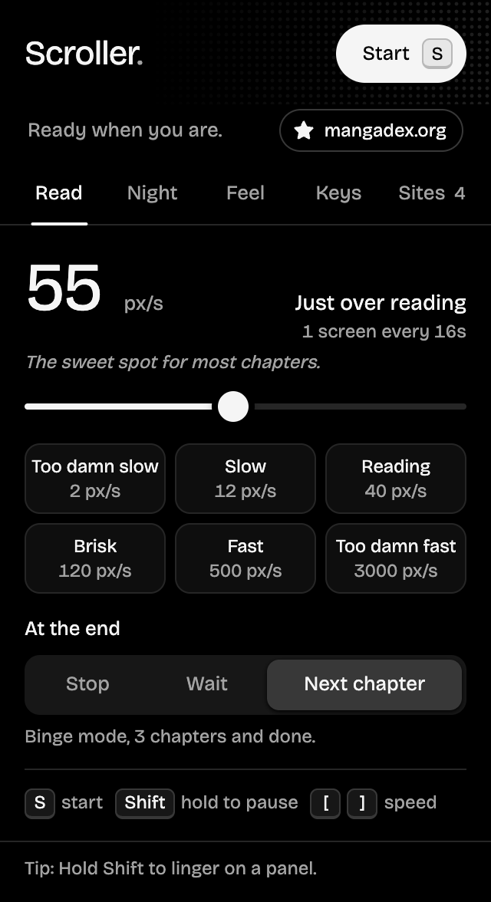
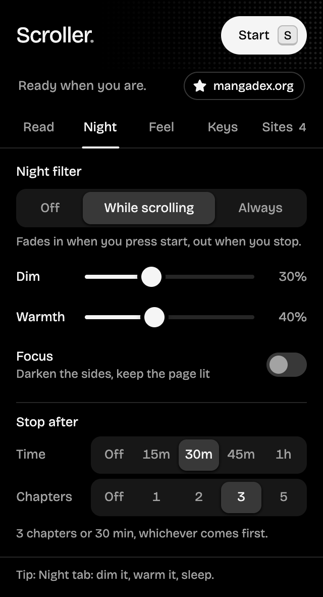
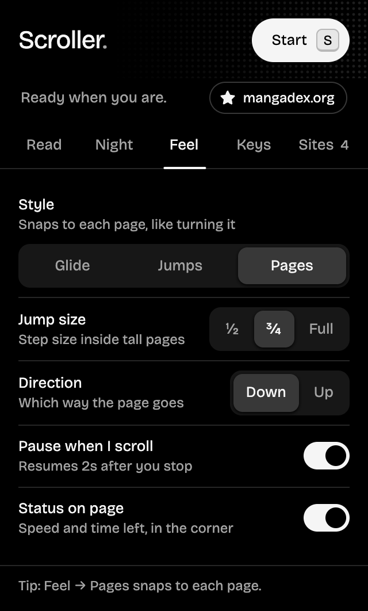
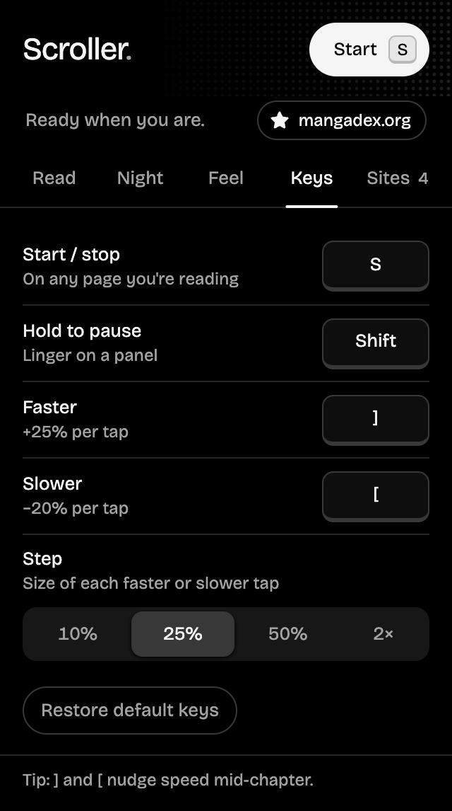

  

<h1 align="center">Scroller</h1>

  Hands-free auto-scroll for reading manga, webtoons and novels, in Chrome and Firefox. 
  Press one key, sit back, read top to bottom at exactly the speed you want. Even in bed.

  
  
  
  

  

<table align="center">
  <tr>
    <td></td>
    <td></td>
    <td></td>
    <td></td>
  </tr>
  <tr>
    <td align="center"><b>Night</b></td>
    <td align="center"><b>Feel</b></td>
    <td align="center"><b>Keys</b></td>
    <td align="center"><b>Sites</b></td>
  </tr>
</table>

## Features

- **A popup that stays out of the way.** Pure black for night reading, five tabs (Read, Night, Feel, Keys, Sites) that each fit without scrolling, and red reserved for one thing: scrolling right now.
- **One key to start and stop.** Defaults to `S`; change it to any key you like.
- **Any speed, 1 to 5000 px/s.** A logarithmic slider gives the slow end as much room as the fast end. Type an exact number, or pick a preset from *Too damn slow* to *Too damn fast*.
- **Words per minute for novels.** On text pages the speed switches to wpm by itself. Scroller measures how much room a word takes in that page's font, line height and column, so 250 wpm reads at 250 words a minute on any site, at any zoom. Chinese and Japanese count characters at a matched pace. Tap the unit to switch a site between wpm and px/s.
- **Remembers speed per site.** Every reader sizes its pages differently, so each site keeps its own speed. New sites start from the last speed you used. The **Sites** tab lists every site's speed; forget any of them (with undo).
- **Favorite sites.** Star the readers you love, from the site chip in the popup or the Sites tab. Favorites are pinned to the top and open in one click. Nothing is starred until you star it.
- **Hold to pause.** Hold `Shift` to freeze on a dense panel; let go and it carries on.
- **Next chapter, automatically.** At the end of a chapter Scroller can find the reader's *Next* button and keep going on the next one. A whole series, hands-free.
- **Adjust while reading.** `]` speeds up, `[` slows down. Pick how big each tap is on the Keys tab: 10%, 25%, 50% or 2×.
- **Glide, jumps or pages.** Scroll continuously, jump ½, ¾ or a full screen at a time, or snap to each manga page: every jump lands with the next page's top at the top of the screen, below the site's header.
- **Night mode.** Dim the page, warm it to candlelight, and turn on **Focus** to darken everything beside the strip or the text. On while scrolling, or always.
- **Stop after** 15 minutes to an hour, or a number of chapters, whichever comes first. Fall asleep mid-binge; Scroller says good night and stops.
- **Time left in the chapter**, counted to the end of the art or text rather than the comments below it, plus a hairline of progress on the pill.
- **Up or down.**
- **Gentle starts and stops.** Eases in and out instead of lurching.
- **Pauses when you scroll yourself**, then eases back in after two seconds.
- **Status at a glance.** A red **ON** badge on the toolbar icon, plus an optional pill on the page with the speed, time left and sleep timer.
- **Works on tricky readers.** Handles sites that use CSS smooth scrolling and readers that scroll an inner panel instead of the page.
- **Chrome and Firefox.** One codebase, a package for each, same features in both.

## Install

Scroller isn't in the Chrome Web Store or on Firefox Add-ons yet, so you load it yourself. It takes 30 seconds. Grab the package for your browser from the [latest release](https://github.com/ShayanHussainSB/scroller/releases/latest).

### Chrome, Edge, Brave, Arc, Opera, Vivaldi

1. Download **`scroller-x.y.z-chrome.zip`** and unzip it.
2. Open `chrome://extensions` (or your browser's extensions page).
3. Turn on **Developer mode** (top right).
4. Click **Load unpacked** and select the unzipped folder.
5. Pin Scroller from the puzzle-piece menu so the icon is one click away.

**Updating:** replace the folder with the new release, click the reload arrow on Scroller's card in `chrome://extensions`, then reload your reader tabs. Your settings are kept.

### Firefox (140 or newer)

1. Download **`scroller-x.y.z-firefox.zip`**. No need to unzip it.
2. Open `about:debugging#/runtime/this-firefox`.
3. Click **Load Temporary Add-on…** and pick the zip.
4. Pin Scroller from the puzzle-piece (Extensions) menu.

Firefox only keeps add-ons that Mozilla hasn't signed until it restarts, so after a restart, load it again the same way. Signed Firefox builds are planned.

### Either browser

Tabs that were already open need a reload before Scroller can run in them. [Watch releases](https://github.com/ShayanHussainSB/scroller/subscription) to hear about new versions.

**From source:** see [CONTRIBUTING.md](CONTRIBUTING.md#development-setup). In short: clone the repo and load the `extension/` folder in Chrome, or run `npm run build` and load the Firefox zip from `dist/`.

## Usage

| Action | Default | Notes |
| --- | --- | --- |
| Start / stop | `S` | Or click **Start** in the popup |
| Hold to pause | `Shift` | Resumes when you let go |
| Faster | `]` | +25% per press by default (Keys → *Step*), saved for this site; steps wpm on text pages |
| Slower | `[` | Undoes one faster press, saved for this site |
| Set an exact speed | | Drag the slider, type a number, or click a preset |
| Switch px/s ⇄ wpm | | Click the unit next to the speed; remembered for the site |
| Remap a key | | Click it in the popup, press the new key (`Esc` cancels) |
| See or forget saved sites | | **Sites** tab; × forgets a site, **Undo** brings it back |
| Reset keys | | **Keys** tab → *Restore default keys* |
| Favorite a site | | Click the star on the site chip, or next to any site in the **Sites** tab |

Keys are ignored while you're typing in a text box. Start, faster and slower never fire with `Ctrl`, `Cmd` or `Alt` held, so they won't clash with browser shortcuts. The hold key may be a modifier (`Shift`, `Ctrl`, `Alt`, `Cmd`) and still passes through to the page, so `Shift`+click keeps working.

### At the end of a page

| Option | What happens |
| --- | --- |
| **Stop** | Scrolling stops at the bottom. |
| **Wait** | Keeps going if more pages load in. Good for infinite-scroll readers. |
| **Next chapter** | Finds the reader's next-chapter link or button, opens it, and keeps scrolling. |

**How Next chapter finds the button.** It scores every visible link and button on its text, label, class names and `rel="next"`. Wording like "chapter" and arrow icons count in its favor. Anything that says *prev*, *back* or *comments* is skipped. If it can't find one, or clicking it doesn't move the page on, Scroller stops rather than looping. It works with readers that load a new page and with readers that swap chapters in place. Two limits: auto-resume can't cross to a different website, and it only applies when scrolling down.

### Night

| Setting | What it does |
| --- | --- |
| **Night filter** | *Off*, *While scrolling* (fades in when you press start, stays while you pause, fades out when you stop) or *Always*. |
| **Dim** | Darkens the whole page, up to 80%. |
| **Warmth** | A candlelight tint that takes the blue out of white pages. |
| **Focus** | Darkens everything beside the reading column: sidebars, side ads, comments. |
| **Stop after** | A time (15 min to 1 hour, from when you press start) or a number of chapters (with *Next chapter*). Whichever comes first ends the session. |

The filter is drawn over the page, never baked into it, so the site's own layout, fixed headers and clicks keep working. Dim and Warmth preview on the page while you drag them.

### Speed guide

| Preset | px/s | Feels like |
| --- | --- | --- |
| Too damn slow | 2 | Barely moving, for dense panels |
| Slow | 12 | Relaxed reading |
| Reading | 40 | Comfortable default for most manga |
| Brisk | 120 | Light dialogue, action scenes |
| Fast | 500 | Skimming |
| Too damn fast | 3000 | Flying through to find your place |

On text pages the presets are in words per minute: *Savoring* 120, *Relaxed* 180, *Reading* 250, *Brisk* 350, *Fast* 500 and *Skimming* 800. A typical adult reads fiction at 200 to 300 wpm.

## Privacy and permissions

No accounts, no tracking, no analytics, no network requests. Settings, including your per-site speeds, stay in your browser's local extension storage. You can review, star and forget saved sites anytime in the popup's **Sites** tab; removing the extension deletes everything.

| Permission | Why |
| --- | --- |
| `storage` | Saves your settings and per-site speeds locally. |
| Runs on all sites | Scroller has to listen for your start key on whatever page you're reading. It does nothing until you press it. Firefox lists this as *Access your data for all websites*. |

## Troubleshooting

- **Nothing happens when I press the key.** Open the popup: if it says *Can't reach this page*, click **Reload tab**. Pages opened before installing or updating don't have Scroller yet. Browser pages (`chrome://`, `about:`) and the Chrome Web Store and Firefox Add-ons sites don't allow extensions at all.
- **Next chapter picked the wrong button, or none.** Every site is different. Switch *At the end* to **Stop**, and please [open an issue](https://github.com/ShayanHussainSB/scroller/issues/new?template=bug_report.yml) with the reader's address so detection can improve.
- **Firefox: nothing happens on any site.** Firefox lets you choose which sites an add-on can use. Open `about:addons`, click Scroller → **Permissions**, and allow *Access your data for all websites*.
- **Firefox: Scroller disappeared.** Unsigned add-ons are unloaded when Firefox restarts; load the zip again from `about:debugging`.
- **A comic shows wpm, or a novel shows px/s.** Scroller guesses from the page's main content. Click the unit next to the speed to switch; it remembers that site.
- **Focus darkened the wrong part.** It looks for the biggest column of images or text near where you are. Scroll a little and it re-checks; if a site still fools it, turn Focus off and [tell us the site](https://github.com/ShayanHussainSB/scroller/issues/new?template=bug_report.yml).
- **It stops when I touch the trackpad.** That's *Pause when I scroll*; it eases back in after two seconds. Turn it off in the popup if you'd rather it didn't.

## Contributing

Bug reports, sites where *Next chapter* misses, and pull requests are all welcome. [CONTRIBUTING.md](CONTRIBUTING.md) covers development setup for both browsers, the project layout, guidelines and how releases work. Please follow the [Code of Conduct](CODE_OF_CONDUCT.md), and report security issues privately as described in [SECURITY.md](SECURITY.md). [CHANGELOG.md](CHANGELOG.md) lists what changed in every release.

## License

[MIT](LICENSE). The bundled Bricolage Grotesque font is licensed separately under the [SIL Open Font License 1.1](extension/fonts/OFL.txt).
