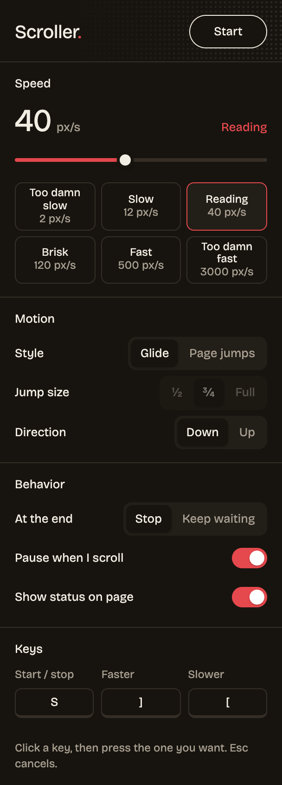

<p align="center">
  
</p>

<h1 align="center">Scroller</h1>

<p align="center">
  Hands-free auto-scroll for reading manga, webtoons and long pages.<br>
  Press one key, sit back, read top to bottom at exactly the speed you want.
</p>

<p align="center">
  
</p>

## Features

- **One key to start and stop.** Defaults to `S`; change it to any key you like.
- **Any speed, 1 to 5000 px/s.** A logarithmic slider gives the slow end as much room as the fast end. Type an exact number, or pick a preset from *Too damn slow* to *Too damn fast*.
- **Adjust while reading.** `]` speeds up, `[` slows down (25% per press). Both keys are remappable.
- **Glide or page jumps.** Scroll continuously, or jump ½, ¾ or a full screen at a time.
- **Up or down.**
- **Stops at the end**, or keeps waiting for more pages to lazy-load.
- **Pauses when you scroll yourself**, then carries on after two seconds.
- **On-page status pill** showing the current speed (optional).
- **Works on tricky readers.** Handles sites that use CSS smooth scrolling and readers that scroll an inner panel instead of the page.

No accounts, no tracking, no network requests. Settings live in your browser's local extension storage.

## Install

Scroller isn't on the Chrome Web Store yet, so you load it unpacked. It takes 30 seconds.

1. [Download this repo](https://github.com/ShayanHussainSB/scroller/archive/refs/heads/main.zip) and unzip it, or `git clone https://github.com/ShayanHussainSB/scroller.git`.
2. Open `chrome://extensions` in Chrome.
3. Turn on **Developer mode** (top right).
4. Click **Load unpacked** and select the **`extension`** folder.
5. Pin Scroller from the puzzle-piece menu so the icon is one click away.

Tabs that were already open need a reload before the extension can run in them.

Works in Chrome and other Chromium browsers (Edge, Brave, Arc, Opera, Vivaldi).

## Usage

| Action | How |
| --- | --- |
| Start / stop | Press `S`, or click **Start** in the popup |
| Faster | `]` |
| Slower | `[` |
| Change speed precisely | Drag the slider, type a number, or click a preset |
| Remap a key | Click the key in the popup, then press the new one (`Esc` cancels) |

Keys are ignored while you're typing in a text box, and never fire with `Ctrl`, `Cmd` or `Alt` held, so they won't clash with browser shortcuts.

### Speed guide

| Preset | px/s | Feels like |
| --- | --- | --- |
| Too damn slow | 2 | Barely moving, for dense panels |
| Slow | 12 | Relaxed reading |
| Reading | 40 | Comfortable default for most manga |
| Brisk | 120 | Light dialogue, action scenes |
| Fast | 500 | Skimming |
| Too damn fast | 3000 | Flying through to find your place |

## Project structure

```
extension/
├── manifest.json        Chrome extension manifest (MV3)
├── scripts/
│   ├── defaults.js      Shared settings, limits and presets
│   └── content.js       The scroller that runs on each page
├── popup/
│   ├── popup.html       Settings popup (markup + styles)
│   └── popup.js         Popup behavior
├── fonts/               Bricolage Grotesque (SIL OFL 1.1)
└── icons/               Toolbar and store icons
docs/                    README assets
```

No build step and no dependencies. Edit a file, hit reload on `chrome://extensions`, done.

## Contributing

Issues and pull requests are welcome. Please keep it dependency-free and small, and test on at least one real reader site before opening a PR.

## License

[MIT](LICENSE). The bundled Bricolage Grotesque font is licensed separately under the [SIL Open Font License 1.1](extension/fonts/OFL.txt).
